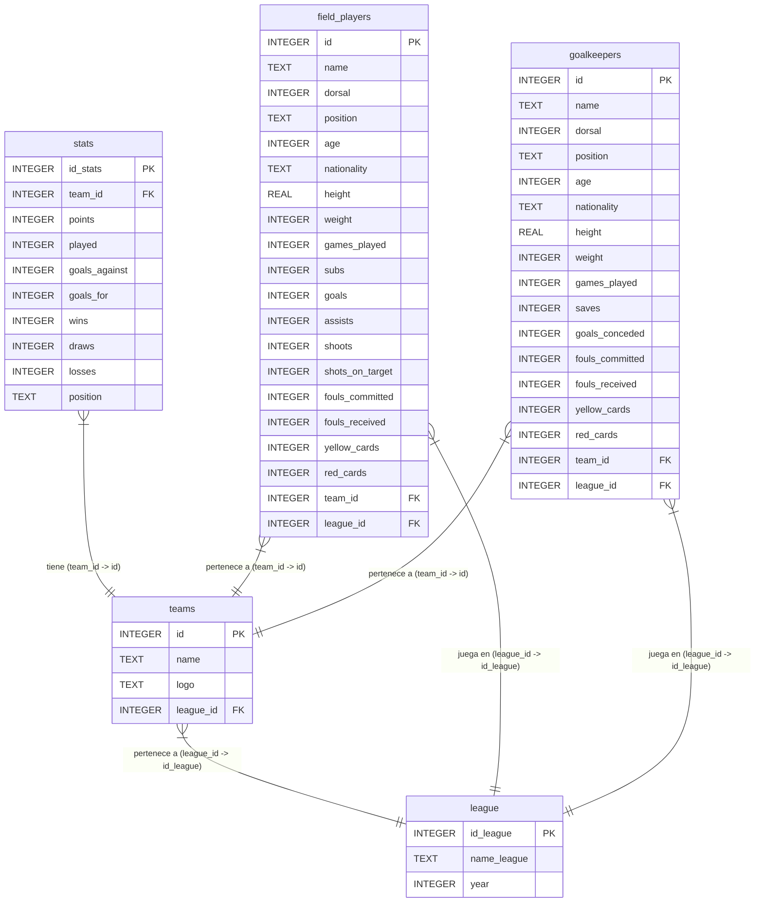
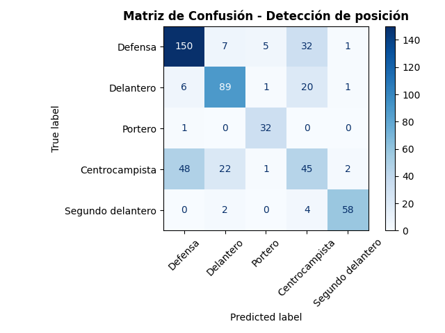
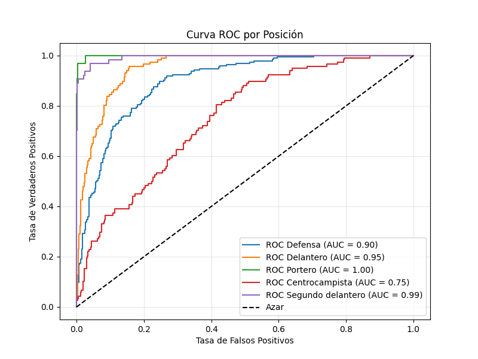
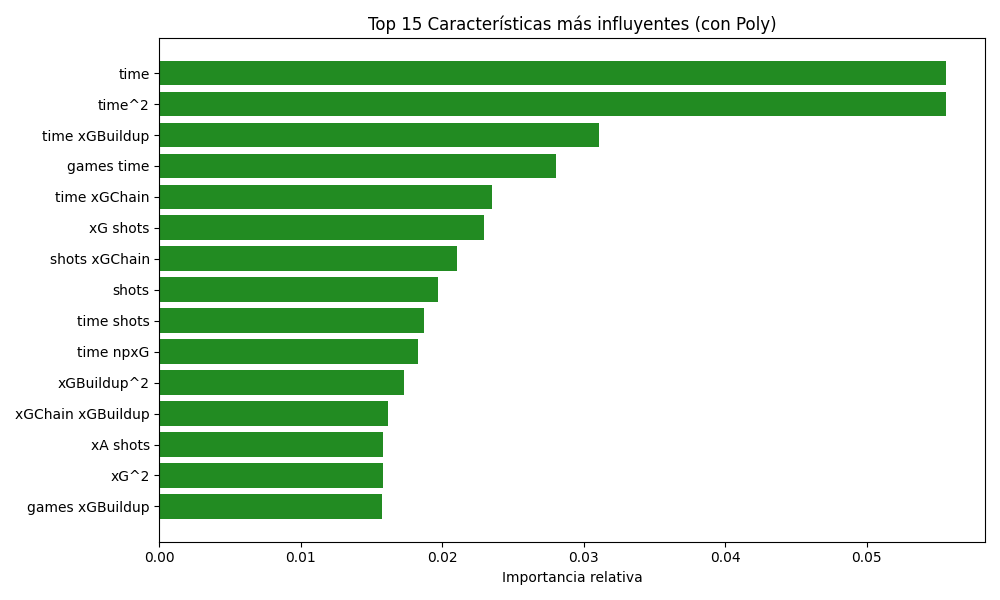
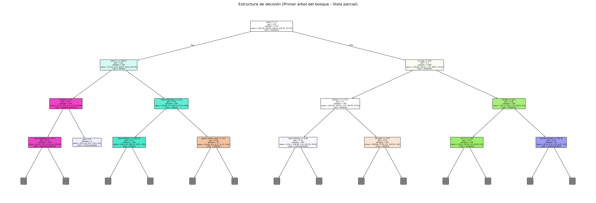

<h1 align="center">🏆 Análisis y Automatización de Datos Futbolísticos</h1>

<p align="center">
  
  
  
  
</p>

<p align="center">
  <strong>Un proyecto automatizado para la extracción, almacenamiento y visualización de métricas deportivas utilizando la API de ESPN.</strong>
</p>

---

## 📋 Descripción del Proyecto

Este proyecto forma parte de una iniciativa colaborativa orientada a crear un flujo de trabajo completo de datos (*Data Pipeline*). El sistema automatiza la recopilación, limpieza, almacenamiento y gestión de estadísticas en tiempo real de las principales ligas europeas de fútbol:

* 🇪🇸 **LaLiga** (España)
* 🇬🇧 **Premier League** (Inglaterra)
* 🇮🇹 **Serie A** (Italia)
* 🇩🇪 **Bundesliga** (Alemania)

Los datos se estructuran en una base de datos relacional para alimentar posteriores análisis exploratorios (EDA) y cuadros de mando interactivos.

## 🎯 Objetivos

1.  **Automatización:** Extraer datos actualizados desde una fuente oficial (API de ESPN) sin intervención manual.
2.  **Ingeniería de Datos:** Diseñar y mantener una base de datos SQLite estructurada e íntegra.
3.  **Procesamiento Eficiente:** Utilizar Polars para una limpieza y filtrado de datos de alto rendimiento.
4.  **Data Storytelling:** Generar visualizaciones claras que permitan extraer conclusiones tácticas y estadísticas sobre los equipos y ligas.

---

## ⚙️ Arquitectura y Funcionamiento

El flujo del proyecto se divide en las siguientes fases metodológicas:

1.  **Extracción (ETL - Extract):** El script `main.py` realiza peticiones HTTP a los endpoints de la API de ESPN, descargando las clasificaciones y estadísticas crudas en formato JSON.
2.  **Almacenamiento (ETL - Load):** Mediante el módulo `db.py`, la información se procesa y se realiza un *Upsert* (inserción o actualización) en la base de datos relacional `soccer.db`.
3.  **Procesamiento (ETL - Transform):** Para el análisis, utilizamos la función `read_database_uri` de **Polars**. Lanzamos consultas SQL directas para generar DataFrames rápidos y optimizados.
4.  **Filtrado Modular:** A partir del DataFrame maestro, aplicamos métodos `.drop()` y filtros específicos para aislar las variables exactas necesarias para cada visualización, optimizando el consumo de memoria.

## 📂 Estructura de directorios

```
Data-Preparation-ESPN-Soccer/
├── main.py                         # Script principal (Web Scraping / API requests)
├── hyperparameters_optimization.py # Busca los mejores hiperparámetros para  el RandomForest
├── skew_calculator.py              # Comprueba si eliminando los sesgos mejora el rendimiento del modelo
├── model_comparator.py             # Comprueba cual es el mejor modelo de un conjunto
├── predict_model.py                # Hace el entrenamiento del modelo final y hace predicciones del conjunto de testing, calculando además las métricas correspondientes
├── carga_datos.py                  # Carga los datos de las diferentes ligas e inserta los datos de los distintos jugadores
├── carga_datos_jugadores.py        # Obtiene los datos de todos los jugadores de las diferentes ligas (Scraping)
├── db.py                           # Gestión y conexión con SQLite
├── soccer.db                       # Base de datos relacional
├── README.md                       # Documentación
├── index.html                      # Página web que centraliza todos los gráficos generados
├── requirements.txt                # Documento que reúne todas las librerías necesarias para la ejecución del proyecto
├── model_info/                     # Imágenes acerca del modelo (Matriz de confusión, features important)
├── graphics/                       # HTMLs interactivos generados por Plotly
└── data_output/                    # CSVs de los datos utilizados para generar los distintos gráficos.

```

## Estructura relacional

| Tabla | Descripción | Contenido Principal |
| :--- | :--- | :--- |
| **`league`** | Almacena la información de las diferentes ligas. | Identificador de la liga, nombre de la competición (ej. LALIGA, Premier League) y la temporada/año. |
| **`teams`** | Contiene el registro de los equipos de fútbol que participan en las ligas. | Nombre del equipo, URL de su escudo o logo, y la referencia a la liga (`league_id`) en la que compiten. |
| **`stats`** | Guarda las estadísticas acumuladas y la clasificación de cada equipo en su liga. | Puntos, partidos jugados, victorias, empates, derrotas, goles a favor/en contra y la posición en la tabla de clasificación. |
| **`field_players`** | Registra la información personal y las métricas de rendimiento de los jugadores de campo (todos menos los porteros). | Nombre, edad, nacionalidad, posición, métricas ofensivas/defensivas (goles, asistencias, tiros a puerta, faltas, tarjetas) y a qué equipo/liga pertenecen. |
| **`goalkeepers`** | Registra la información personal y las estadísticas específicas de los porteros. | Nombre, edad, nacionalidad, métricas exclusivas de su posición (paradas, goles encajados, tarjetas) y a qué equipo/liga pertenecen. |


---

## 📊 Visualizaciones y Análisis de Datos

> 💡 **Nota:** Haz clic en los títulos de cada gráfico para abrir la **versión interactiva** alojada en GitHub Pages.

- En primer lugar, tenemos un gráfico que representa la <a href="https://davidcaraballobulnes.github.io/Data-Preparation-ESPN-Soccer/graficos/Media_Goles_Partido_Ligas.html">media de goles por partido en cada liga</a>

    

  Podemos ver que la liga en la que se marcan más goles es la Bundeliga (la liga alemana) y la liga en que menos goles se marcan es la Serie A (la liga italiana). Esto puede indicar que en la liga alemana hay mejores delanteros o que en la liga italiana hay mejores defensas y porteros.

- Parecido al gráfico anterior, tenemos la <a href="https://davidcaraballobulnes.github.io/Data-Preparation-ESPN-Soccer/graficos/Media_Puntos_Partidos_Ligas.html">media de puntos por partido en cada liga</a>

  

  Concluimos que está muy reñida la cosa en cuestión de puntos. En todas las ligas se suelen sacar en torno a 1,4 puntos por partido, esto indica que se empata más de lo que se gana.

- A continuación, vemos una <a href="https://davidcaraballobulnes.github.io/Data-Preparation-ESPN-Soccer/graficos/Victorias_Empates_Por_Liga.html">gráfica donde podemos ver las victorias y los empates de cada liga</a>

  

  Podemos ver que en la Serie A es donde más empates hay, mientras que en la Bundesliga es donde menos empates tiene. La Premier y LALIGA es un término medio, aunque la diferencia entre todas no es tan grande.

  En cuanto a las victorias, la Bundesliga es donde más victorias hay (debido a que tienen menos empates), luego le sigue LALIGA.

  De esto podemos decir que la Bundesliga tiene más partidos decisivos (menos empates), donde los partidos son más ofensivos, mientras que la Serie A los equipos, es posible que jueguen con un bloque defensivo     mayor. La liga en el que podemos decir que hay un equilibrio entre el bloque defensivo y ofensivo es en la Premier, ya que su porcentaje de victorias y empates son muy parejos.

- Luego, podemos ver una <a href="https://davidcaraballobulnes.github.io/Data-Preparation-ESPN-Soccer/graficos/Equipos_Eficientes_GD_Puntos_Por_Partido.html">gráfica donde observamos la correlación entre los goles de diferencia y los puntos por partido de cada equipo de        cuatro ligas distintas</a>

  

  En esta gráfica podemos ver que, cuanto mayor son los goles de diferencia, mayor son los puntos por partido, pero lo interesante de esta gráfica es mirar en ciertos sectores de la gráfica donde hay equipos que   tienen el mismo gol de diferencia pero hay algunos que tienen menos puntos por goles que otros. Un ejemplo que podemos ver en la gráfica es el Espanyol y el Elche, donde ambos tienen los mismos goles de          diferencia, pero el Espanyol tiene más puntos por partidos que el Elche, esto se pueden llamar casos "injustos", pero podemos deducir que existe la posibilidad de que el Elche ha perdido muchos partidos por un   gol de diferencia y en otros partidos ha metido muchos goles a favor, mientras que el Espanyol ha ganado muchos partidos por un gol de diferencia, y en otros pocos haya perdido por 2-3 goles en contra, de esta   forma ambos tienen los mismos goles de diferencia, pero el Espanyol más puntos por partidos.

- Por otro lado, podemos ver una <a href="https://davidcaraballobulnes.github.io/Data-Preparation-ESPN-Soccer/graficos/Ataques_vs_Defensas_Por_Equipo.html">gráfica donde se compara los goles a favor y en contra de cada equipo</a>

  

  La gráfica esta dividida en diferentes secciones, para ello he obtenido la media de los goles a favor y en contra y con esas medias he añadidos las líneas que separan en diferentes sectores. Podemos visualizar   los equipos que tienen mala/buena defensa y mal/buen ataque. Viendo las diferentes secciones, podemos ver que la liga que tiene mejores ataques es la Premier, donde diez equipos se encuentran en la parte de la   derecha (donde se encuentran los equipos con mejores ataques), luego le sigue la Bundesliga con 9 equipos, mientras que el equipo que tienen menos equipos en la sección de buenos ataques es la Serie A. Por       otro lado, las ligas con mejores defensas es LALIGA y la Serie A con 11 equipos en la parte inferior donde se encuentran los equipos con mejores defensas. La liga que peor defensa tiene según la gráfica es la    Bundesliga, donde tiene solo 7 equipos con buenos defensas, y 4 de ellos se encuentran muy cerca de la frontera, por lo que si la media cambia, podrían cambiar de sección.

- Por otra parte, podemos observar esta gráfica, que nos muestra el <a href="https://davidcaraballobulnes.github.io/Data-Preparation-ESPN-Soccer/graficos/Ligas_Mas_Defensivas.html">promedio de goles en contra por liga</a>

  

  Podemos observar que, donde más goles encajados hay es en la Bundesliga, superando por mucho el promedio total de los goles encajados de las 4 ligas estudiadas. Esto nos hace ver que lo analizado anteriormente   (Bundesliga peores defensas y menos empates) tenga sentido, ya que tiene más goles encajados. Por otro lado, la liga que menos goles encajados tiene es la Serie A, que relacionado con gráficas anteriores         podemos concluir que tiene sentido, ya que es la liga que más empates hay y menos equipos tienen buen ataque. En cuanto a LALIGA y la Premier League, podemos ver que siguen un equilibro, aunque la Premier        supera por poco la media global de goles encajados.

- Luego pasamos a los datos de los jugadores, en este caso vemos los <a href="https://davidcaraballobulnes.github.io/Data-Preparation-ESPN-Soccer/graficos/Goles_Asistencias_Extremos.html">goles y asistencias de los mejores extremos del mundo</a>

  

  Vemos en un gráfico apilado tanto los goles, como las asistencias de los extremos del mundo, donde en primer lugar está Lamine Yamal, luego le sigue don Vinicius Junior y en tercer lugar Raphinha. A la derecha   podemos observar un gráfico Scatter, pero con los mismos datos, en el que cuanto más alto estes más asistencias tiene, y cuanto más a la derecha en el eje X más goles.

- Además, otro gráfico interesante que mirar acerca de los extremos son las <a href="https://davidcaraballobulnes.github.io/Data-Preparation-ESPN-Soccer/graficos/Faltas_Recibidas_Extremos.html">faltas recibidas por partidos</a>

  

  Siendo extremo, los goles no son lo más importante, eso es trabajo del delantero centro, lo más importante jugando en esa posición son las asistencias y las faltas recibidas por partido, ya que eso quiere        decir que el extremo encara mucho, quizas sea un jugador rápido o rápido en conducción, por lo que es díficil de parar, a no ser que sea con faltas, de esta forma, se genera una ventaja al equipo que recibe la   falta. En este caso vemos que, don Vinicius Junior es el que más faltas recibe de todos los extremos analizados, siguiendole Lamine Yamal.


-  Ahora, vamos a ver un gráfico comparando la <a href="https://davidcaraballobulnes.github.io/Data-Preparation-ESPN-Soccer/graficos/Media_Edades_Equipos.html">edad media de la plantilla de cada equipo</a>
  

      

      Podemos ver que el Chelsea tiene una media de edad de aproximadamente 22 años. Eso indica que dicho equipo tendrá asegurada la plantilla durante mínimo una década. Por otro lado, tenemos equipos como el Rayo Vallecano y el SC Freiburg, cuya media es de 27 años aproximadamente. Éstos deberán renovar la plantilla de manera más inmediata.

-  Otra forma de representar los datos anteriores, es mediante <a href="https://davidcaraballobulnes.github.io/Data-Preparation-ESPN-Soccer/graficos/Boxplot_Edades_Equipos.html">boxplot</a>

    

    Este gráfico nos ayuda a ver la representación de las edades de cada plantilla mediante cajas con bigotes. Gracias a ello, podemos ver, que en algunas ocasiones la media de los equipos aumenta debido a diversos outliers. Por ejemplo, en el Manchester United, hay un outlier (un jugador de 39 años) que hace que aumente la media de edad.
    
-  Por último, tenemos un mapa geográfico representando los <a href="https://davidcaraballobulnes.github.io/Data-Preparation-ESPN-Soccer/graficos/Total_Goles_Nacionalidad.html">goles que han marcado los jugadores según su nacionalidad</a>

    

    En primer lugar, si nos fijamos en los goles totales, podemos observar que el país ganador es España con una clara diferencia, superando los 300 goles. Esto se debe, en su mayor parte, a la cantidad de jugadores de cada nacionalidad, teniendo éste  más de 400. También, destacan países como Alemania, Inglaterra y Francia, que, pese a tener la mitad de jugadores, han estado cerca. Sin embargo, si nos fijamos en la media de goles por número de jugadores, podemos ver que Canadá y Bosnia y Herzegovina tienen una gran media con respecto a los otros países.

## 📊 Análisis con Tableau

- Conexión con CSV

  Para el análisis en Tableau, hemos usado los CSVs que se generan al ejecutar el arhcivo "main.py", creando una nueva fuente de datos en Tableau por cada CSV. Sin embargo, hay un caso particular en los CSVs de los extremos, donde se ha hecho una relación entre ambos CSV por el id del jugador ("Goles_Asistencias_Extremos.csv" y "Faltas_Recibidas_Extremos.csv"). En todos los CSV donde habia números decimales con puntos, hemos tenido que crear un campo nuevo con la función "FLOAT()" para parsearlo a decimal.

  También se han hecho algunos cálculos como "Goal Diff Per Game" donde se ha dividido los goles de diferencias con los partidos jugados de cada equipo, obteniendo así el nuevo campo, e incluso hemos realizado campos más complejos como calcular, dependiendo de la media de goles recibidos y encajados y la media del equipo correspondiente, si un equipo tiene buena/mala defensa y buen/mal ataque. Este sería el código correspondiente para calcular dicho campo:

  IF [avg_goals_for] > { FIXED : AVG([avg_goals_for]) }
  THEN "Mucho ataque"
  ELSE "Poco ataque"
  END
  +" / "+
  IF [avg_goals_against] < { FIXED : AVG([avg_goals_against]) }
  THEN "Mucha defensa"
  ELSE "Poca defensa"
  END

  ---

- Gráficas

 - En primer lugar veremos un gráfico barras diferencia de goles
   
  

  En esta gráfica podemos ver los goles de diferencia de cada equipo por partido de las ligas que se han analizado anteriormente con Plotly, podemos observar que el equipo que más goles de diferencia tiene, con bastante diferencia con respecto al segundo, es el Bayern de Munich con 2.783 goles de diferencia por partido. Luego podemos ver que le sigue el Barcelona con 1.68 goles de diferencia por partido.

 - Luego, podemos ver un gráfico de goles y asistencia de los extremos

   

   Esta gráfica es una bastante parecida a una anterior comentada hecha con Plotly, solo que en este caso, en luga de ser apiladas, son dos barras juntas, podemos ver que en primer lugar sigue siendo Lamine Yamal el que tiene más goles/asistencias, siguiendole luego Vinicius Junior.

  - Por otro lado, podemos ver una representación de las faltas que han recibido los extremos por partido

    

    Esta gráfica es bastante parecida a otra anterior hecha con Plotly pero en lugar de barras verticales, son barras horizontales. Como comentamos en el análisis hecho con Plotly, siendo un jugador extremo, el trabajo es crear juego, los goles es cosa del delantero centro, por lo que una métrica interesante de analizar son las faltas recibidas por partido (ya que con las faltas se crea juego a balón parado). Vemos que el extremo que más falta recibe por partido es Vinicius Junior, siguiendole Lamine Yamal. Podemos concluir que estos dos extremos son los más determinantes de las cuatro grandes ligas.

  - Por último, podemos ver una tabla resumen de los extremos

    

- Dashboards
  
  - Dashboard estadísticas de equipos (<a href="https://public.tableau.com/app/profile/adri.n.garc.a.garc.a/viz/3_2_GarciaGarcia_CaraballoBulnes/Dashboard1">enlace público a Tableau Public</a>)
  


  
  

  ---
  
  - Dashboard de estadísticas de extremos (<a href="https://public.tableau.com/app/profile/adri.n.garc.a.garc.a/viz/3_2_GarciaGarcia_CaraballoBulnes/Dashboard3">enlace público a Tableau Public</a>)


  
  

- Historias
  
  
  

  ---
  
  
  

---

# ⚽ Predicción de Posiciones de Jugadores de Fútbol mediante Machine Learning

## 📖 Descripción del Apartado

Este apartado supone la transición de un análisis de datos descriptivo a un **análisis predictivo**. El objetivo principal es clasificar y predecir la posición táctica principal de un jugador de fútbol (Defensa, Delantero, Portero, Centrocampista o Segundo delantero) basándonos en sus estadísticas de juego avanzadas (goles esperados, xGChain, pases clave, minutos jugados, etc.). 

## ⚙️ Metodología y Preprocesamiento

Para preparar los datos para el modelado, se llevaron a cabo los siguientes pasos:
1. **Limpieza de la variable objetivo:** Muchos jugadores tienen múltiples posiciones. Nos quedamos exclusivamente con la primera posición (la principal) para entrenar el modelo.
2. **Feature Engineering:** - Se crearon métricas normalizadas por partido (`tackles_per_game`, `goals_per_game`, etc.) para compensar la diferencia de minutos jugados entre futbolistas.
   - Se aplicó `PolynomialFeatures (degree=2)` para capturar relaciones no lineales y multiplicativas entre las variables, lo cual mejoró significativamente el rendimiento.
3. **Análisis de Sesgo:** Evaluamos transformaciones Logarítmicas y de Yeo-Johnson para variables asimétricas (como `time` o `xG`). Tras pruebas empíricas, se descartaron a favor del rendimiento computacional, ya que el modelo final demostró robustez ante estas distribuciones.

## 🤖 Selección y Ajuste del Modelo

Para asegurar la mejor elección del algoritmo, implementamos una estrategia comparativa evaluando 5 modelos diferentes (KNN, SVM, Decision Tree, Random Forest y Gradient Boosting), tanto con datos escalados como no escalados. 

**Criterio de elección:** El **Random Forest Classifier (con datos no escalados)** fue seleccionado como el algoritmo óptimo al superar consistentemente al resto de modelos en las métricas de precisión, recall y F1-Score.

Para maximizar su rendimiento y controlar el sobreajuste (*overfitting*), utilizamos `GridSearchCV` para encontrar los hiperparámetros óptimos (como `n_estimators=200` y `max_depth=20`).

## 📊 Resultados e Interpretación de Métricas

### 1. Matriz de Confusión


**Interpretación:** El modelo es excelente detectando Porteros (clase 2) y Segundos Delanteros (clase 4). Observamos que existe cierta confusión entre Defensas y Centrocampistas. Lejos de ser un error, esto indica que el modelo aprende patrones tácticos reales, ya que muchos centrocampistas de corte defensivo comparten perfiles estadísticos casi idénticos a los defensas centrales o laterales.

### 2. Curva ROC-AUC multiclase


**Interpretación:** La capacidad de discriminación es casi perfecta para los porteros (AUC = 1.00) y segundos delanteros (AUC = 0.99). Las clases de delanteros y defensas mantienen un área bajo la curva muy sólida, demostrando la fiabilidad general del modelo.

### 3. Importancia de Características (Feature Importance)


**Valor aportado:** Este gráfico nos permite entender el "por qué" de las decisiones del modelo. Descubrimos que el tiempo de juego, combinado de forma polinómica con métricas avanzadas como el `xGBuildup` (goles esperados de una jugada ofensiva excluyendo la asistencia y el tiro), son los factores más determinantes para definir el rol táctico de un jugador.

### 4. Estructura de Decisión (Árbol del Bosque)


Una vista parcial a cómo razona el algoritmo: la primera gran división táctica que hace el modelo es evaluar si el jugador realiza más o menos de 1.5 tiros. A partir de ahí, ramifica las decisiones combinando el tiempo jugado y los goles esperados.

## 🏁 Conclusiones

El modelado aplicado ha demostrado que es posible traducir el rendimiento estadístico bruto en perfiles tácticos definidos. Aunque el modelo presenta un Accuracy en entrenamiento de 0.97 y en test de 0.71, hemos validado que esta diferencia se debe a la naturaleza multiclase y a la similitud real entre ciertas posiciones (como los centrocampistas defensivos), confirmando que **el algoritmo generaliza patrones y no memoriza datos**.
## 🛠️ Stack Tecnológico

* **Lenguaje:** Python 3
* **Bases de Datos:** SQLite3
* **Procesamiento de Datos:** Polars
* **Peticiones API:** Requests, JSON
* **Visualización:** Plotly (Gráficos interactivos), Matplotlib
* **Control de Versiones:** Git & GitHub

---

## 🚀 Instalación y Ejecución

Sigue estos pasos para replicar el proyecto en tu entorno local:

1. **Clonar el repositorio:**
   git clone https://github.com/DavidCaraballoBulnes/Data-Preparation-ESPN-Soccer
   cd Data-Preparation-ESPN-Soccer

2. **Instalar las dependencias necesarias:**
   pip install requests matplotlib polars plotly

3. **Ejecutar el script de extracción (ETL):**
   python main.py
   *(Esto consultará la API y poblará/actualizará la base de datos `soccer.db`)*

---

## 👥 Autores

Desarrollado con 💻 y ⚽ por:
* **Adrián García García** - [GitHub](https://github.com/4drian04) | [LinkedIn](https://www.linkedin.com/in/adri%C3%A1n-garc%C3%ADa-garc%C3%ADa-6ab399333/)
* **David Caraballo Bulnes** - [GitHub](https://github.com/DavidCaraballoBulnes) | [LinkedIn](https://www.linkedin.com/in/david-caraballo-bulnes-791968239/)


